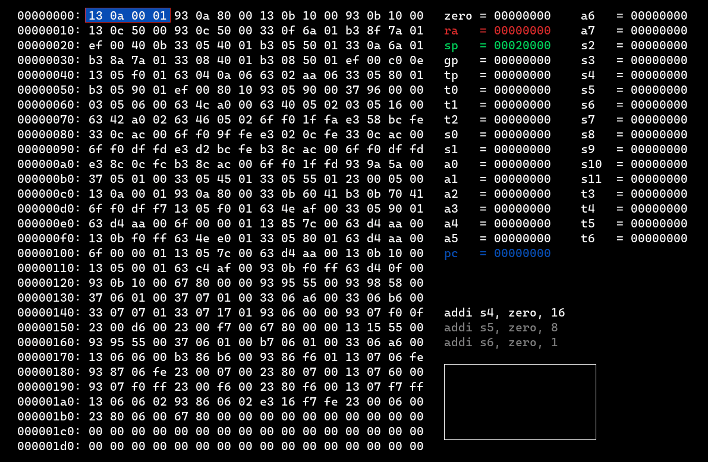
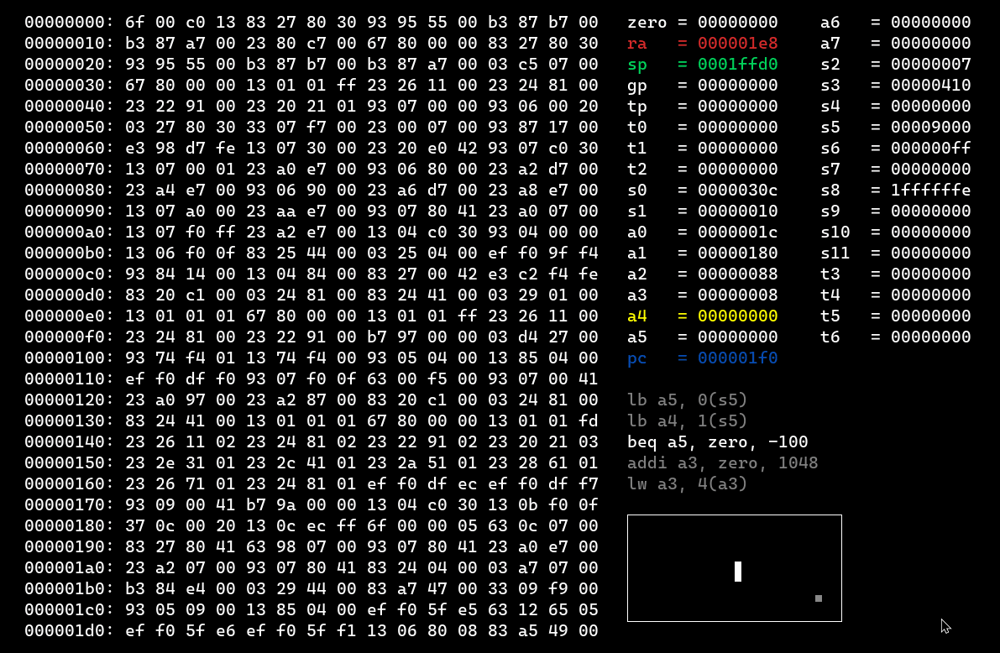

# RISC-V Emulator and Disassembler

**RISC-V Emulator and Disassembler** is an interactive environment for running and visualizing RISC-V programs. It allows you to load RISC-V code, see its memory layout, inspect registers, and step through instructions. A portion of memory is mapped to the screen, and you can view the graphical output in real-time.

## Features

- **Disassembler**: View the assembly code corresponding to the compiled RISC-V program.
- **Memory Visualization**: View the memory layout, with specific regions mapped to the screen and input keys.
- **Register Inspection**: See the current state of RISC-V registers during execution.
- **Step/Auto-Step Mode**: Step through the program manually or run automatically to observe execution.
- **Screen Mapping**: A region of memory is mapped to the screen, allowing you to see graphical output.
  
## Example

Below are GIFs showing the **Pong** and **Snake** games running on the emulator, demonstrating the real-time memory and screen mapping:

### Pong Game

### Snake Game

The emulator not only runs the programs but also maps part of memory to the screen, allowing for graphical output to be displayed and interacted with.

## Dependencies

- **[SDL2](https://www.libsdl.org/)** - Manages windowing, input, and graphics rendering.
- **[SDL2_ttf](https://github.com/libsdl-org/SDL_ttf)** - Used for rendering text in the emulator interface.
